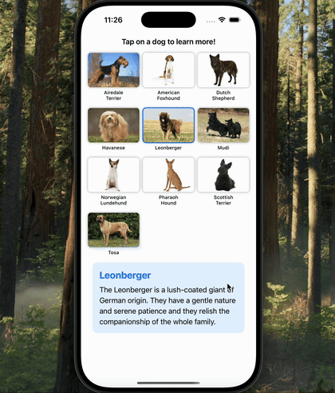

# Dog Breeds App

A simple SwiftUI app that displays various dog breeds and their descriptions.

## Assignment Details
- **Assignment**: Partner Lab 1
- **Group**: #5
- **Partners**: David Deng & Joshua Holmberg
- **Date**: September 11, 2025

## Features
- Interactive grid display of 10 different dog breeds
- Tap any dog image to view its description
- Clean, responsive UI with animations
- Dog breed information sourced from breed descriptions

## Dog Breeds Included
- Airedale Terrier
- American Foxhound
- Dutch Shepherd
- Havanese
- Leonberger
- Mudi
- Norwegian Lundehund
- Pharaoh Hound
- Scottish Terrier
- Tosa

## How to Use
1. Launch the app
2. Browse the dog breed images in the grid
3. Tap on any dog image to see its description below
4. The selected dog will be highlighted with a blue border

## Technical Details
- Built with SwiftUI
- Uses `@State` property wrapper for state management
- Implements `LazyVGrid` for responsive layout
- Combines arrays into dictionary for data management

## Setup
1. Clone the repository
2. Open `Lab1.xcodeproj` in Xcode
3. Run the project on iOS simulator or device

## Demo Video
A demonstration video showing the app functionality is included in the project folder.## Demo

